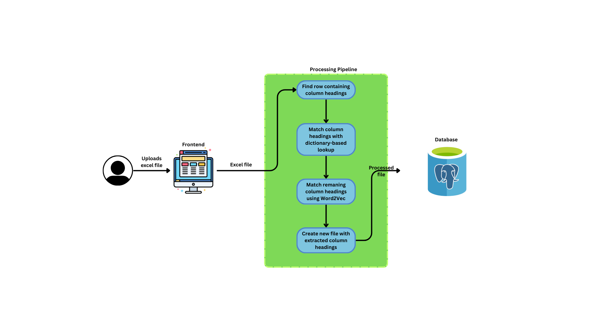

# 📂 Streamlining Data Workflows: ETL Pipeline for Excel Data Extraction

> **Role:** Data Scientist  
> **Client:** U.S.-based Logistics Company  
> **Published:** October 05, 2024

---

---

## 📦 Project Overview

Excel remains a core format in logistics, but dealing with hundreds of files in inconsistent formats was overwhelming for our client. I designed and implemented an intelligent **ETL pipeline** using a **Flask API** and **Word2Vec-based heuristics** to automate the majority of the work.

This solution achieved an **80% success rate** in auto-processing files, drastically reducing manual labor and human error.

---

## 🚧 Key Challenges

1. Inconsistent column headers and messy Excel structures  
2. Lack of metadata to identify relevant columns  
3. Needed to serve non-technical users with minimal UX friction  
4. Sensitive logistics data demanded secure processing  

---

## 🧠 Solution

### a) Preprocessing and Header Matching  
Implemented smart header extraction using:

- ✅ **Dictionary-based mapping**
- ✅ **Word2Vec similarity scoring**
- ✅ **Fallback heuristics for ambiguous matches**

---

### b) Flask API Development  
Built a lightweight API to:

- Accept Excel uploads  
- Process files through the extraction pipeline  
- Return clean, standardized files  

Deployed using **Azure App Services**.

---

### c) Frontend Interface  
Created a user-friendly upload interface for non-technical staff to interact with the system seamlessly.

---

### d) PostgreSQL Integration  
Stored processed output in a **secure, scalable Postgres database** for reporting and audit logging.

---

## 🚀 Results

- 🔁 80% of Excel files processed with zero manual intervention  
- ⏱ Reduced data cleaning time from **hours to seconds**  
- 🔒 Secure and scalable deployment ready for future growth  
- 👥 Higher adoption rate among operations and finance staff  

---

## 🛠 Tech Stack

| Component     | Tools / Frameworks        |
|--------------|---------------------------|
| Language      | Python                    |
| Backend API   | Flask                     |
| Embedding     | Word2Vec (Gensim)         |
| Database      | PostgreSQL                |
| Deployment    | Azure App Services        |

---

## 💡 Highlights

- ✅ Developed a resilient preprocessing system that handled malformed Excel sheets  
- 🧠 Leveraged ML techniques to match headers even with poor formatting  
- 📥 Enabled instant upload + standardized output without code or Excel formulas  
- 🌍 Designed to scale with future client needs  

---

> **Note:** The project code is confidential and owned by the client. This repository only shares the architecture and approach for educational and portfolio purposes.
